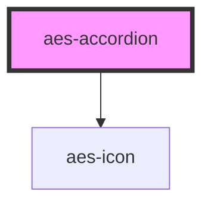

# aes-accordion

<!-- Auto Generated Below -->

## Properties

| Property | Attribute | Description                                             | Type      | Default |
| -------- | --------- | ------------------------------------------------------- | --------- | ------- |
| `isOpen` | `is-open` | Whether to display the accordion in open or close state | `boolean` | `false` |

## Slots

| Slot        | Description                                        |
| ----------- | -------------------------------------------------- |
| `"content"` | The primary slot to render the accordion contents. |
| `"summary"` | The slot to render the accordion summary or title. |

## Dependencies

### Depends on

- [aes-icon](../aes-icon)

### Graph

----------------------------------------------

*Built with [StencilJS](https://stenciljs.com/)*
