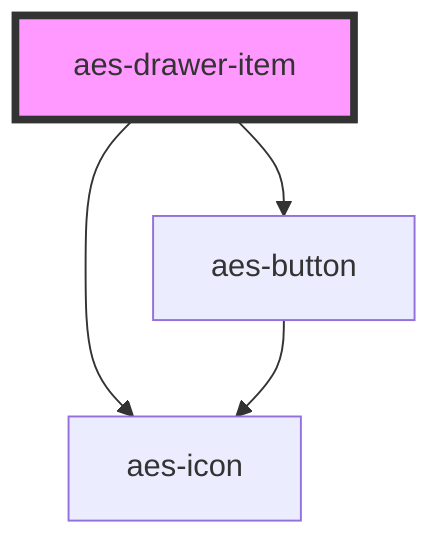

# aes-drawer-item

<!-- Auto Generated Below -->

## Properties

| Property | Attribute | Description                                     | Type       | Default     |
| -------- | --------- | ----------------------------------------------- | ---------- | ----------- |
| `icon`   | `icon`    | Choose which predefined icon to add to the link | `IconType` | `undefined` |

## Dependencies

### Depends on

- [aes-button](../aes-button)
- [aes-icon](../aes-icon)

### Graph

----------------------------------------------

*Built with [StencilJS](https://stenciljs.com/)*
