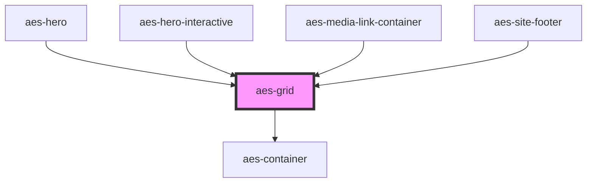

# aes-grid

<!-- Auto Generated Below -->

## Properties

| Property     | Attribute      | Description                                                                                                                                    | Type                                       | Default     |
| ------------ | -------------- | ---------------------------------------------------------------------------------------------------------------------------------------------- | ------------------------------------------ | ----------- |
| `gapSize`    | `gap-size`     | How much of a gap should exist between columns? (This affects both the vertical and horizontal column/row gaps.)                               | `"large" \| "medium" \| "none" \| "small"` | `'small'`   |
| `gapSizeLg`  | `gap-size-lg`  | How much of a gap should exist between columns on large+ screens? (This affects both the vertical and horizontal column/row gaps.)             | `"large" \| "medium" \| "none" \| "small"` | `undefined` |
| `gapSizeMd`  | `gap-size-md`  | How much of a gap should exist between columns on medium+ screens? (This affects both the vertical and horizontal column/row gaps.)            | `"large" \| "medium" \| "none" \| "small"` | `undefined` |
| `gapSizeSm`  | `gap-size-sm`  | How much of a gap should exist between columns on small+ screens? (This affects both the vertical and horizontal column/row gaps.)             | `"large" \| "medium" \| "none" \| "small"` | `undefined` |
| `gapSizeXl`  | `gap-size-xl`  | How much of a gap should exist between columns on extra large+ screens? (This affects both the vertical and horizontal column/row gaps.)       | `"large" \| "medium" \| "none" \| "small"` | `undefined` |
| `gapSizeXxl` | `gap-size-xxl` | How much of a gap should exist between columns on extra extra large+ screens? (This affects both the vertical and horizontal column/row gaps.) | `"large" \| "medium" \| "none" \| "small"` | `undefined` |
| `isNested`   | `is-nested`    | Whether or not this is a nested grid. If it's nested, remove padding from the container.                                                       | `boolean`                                  | `false`     |

## Slots

| Slot            | Description |
| --------------- | ----------- |
| `"defaultSlot"` |             |

## Dependencies

### Used by

 - [aes-hero](../aes-hero)
 - [aes-hero-interactive](../aes-hero-interactive)
 - [aes-media-link-container](../aes-media-link-container)
 - [aes-site-footer](../aes-site-footer)

### Depends on

- [aes-container](../aes-container)

### Graph

----------------------------------------------

*Built with [StencilJS](https://stenciljs.com/)*
