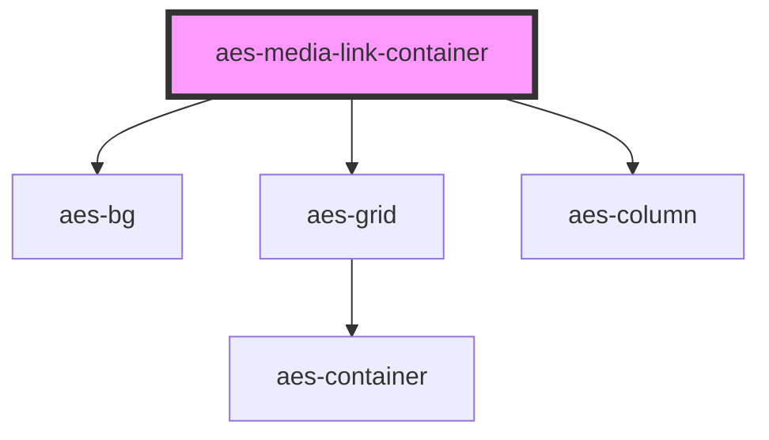

# aes-media-link-container

<!-- Auto Generated Below -->

## Properties

| Property  | Attribute  | Description                                                           | Type                                                                                                                                                        | Default            |
| --------- | ---------- | --------------------------------------------------------------------- | ----------------------------------------------------------------------------------------------------------------------------------------------------------- | ------------------ |
| `bgColor` | `bg-color` | Which brand color should be used as the background of this container? | `"neutrals-black" \| "neutrals-gray1" \| "neutrals-gray2" \| "neutrals-gray3" \| "neutrals-gray4" \| "neutrals-gray5" \| "neutrals-white" \| "transparent"` | `'neutrals-gray1'` |

## Slots

| Slot            | Description                                                         |
| --------------- | ------------------------------------------------------------------- |
| `"media-links"` | The media link slot. Contains a links to resource documents.        |
| `"title"`       | The title slot; the text displayed in the left column of container. |

## Dependencies

### Depends on

- [aes-bg](../aes-bg)
- [aes-grid](../aes-grid)
- [aes-column](../aes-column)

### Graph

----------------------------------------------

*Built with [StencilJS](https://stenciljs.com/)*
