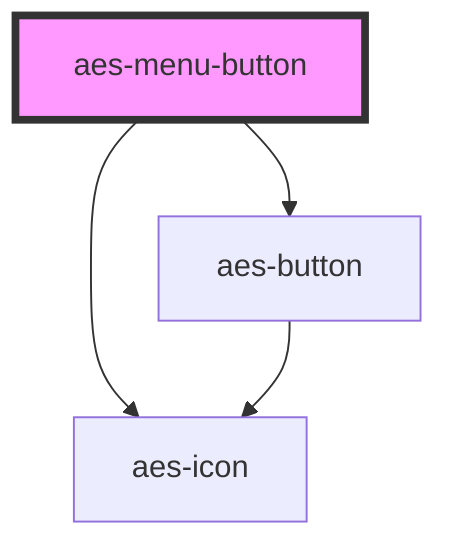

# aes-menu-button

<!-- Auto Generated Below -->

## Properties

| Property             | Attribute              | Description                                                                                                                | Type       | Default     |
| -------------------- | ---------------------- | -------------------------------------------------------------------------------------------------------------------------- | ---------- | ----------- |
| `icon`               | `icon`                 | The name of the icon being used for the button.                                                                            | `IconType` | `undefined` |
| `shouldDisplayArrow` | `should-display-arrow` | Whether to display a right arrow after the slot                                                                            | `boolean`  | `false`     |
| `url`                | `url`                  | The url to use for a link. This will render an anchor element. Do not set this prop if you are using the clickAction prop. | `string`   | `undefined` |

## Dependencies

### Depends on

- [aes-button](../aes-button)
- [aes-icon](../aes-icon)

### Graph

----------------------------------------------

*Built with [StencilJS](https://stenciljs.com/)*
