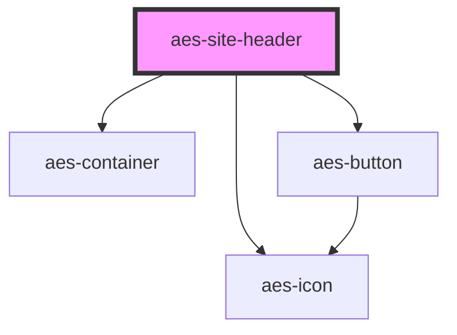

# aes-site-header

<!-- Auto Generated Below -->

## Slots

| Slot             | Description                                                        |
| ---------------- | ------------------------------------------------------------------ |
| `"logo"`         | The logo element to display in the site header.                    |
| `"nav"`          | The list items to be included in the primary navigation.           |
| `"search-form"`  | The markup for the search form.                                    |
| `"user-buttons"` | The area in which user account and language buttons can be placed. |

## Dependencies

### Depends on

- [aes-container](../aes-container)
- [aes-button](../aes-button)
- [aes-icon](../aes-icon)

### Graph

----------------------------------------------

*Built with [StencilJS](https://stenciljs.com/)*
