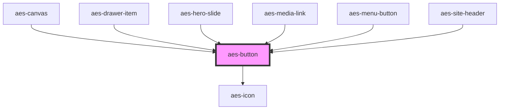

# aes-button

<!-- Auto Generated Below -->

## Properties

| Property             | Attribute              | Description                                                                                                                 | Type                                                 | Default     |
| -------------------- | ---------------------- | --------------------------------------------------------------------------------------------------------------------------- | ---------------------------------------------------- | ----------- |
| `disabled`           | `disabled`             | Whether the button is disabled. Only applies to implementations not using the url prop                                      | `boolean`                                            | `undefined` |
| `shouldDisplayArrow` | `should-display-arrow` | Whether to display a right arrow after the slot                                                                             | `boolean`                                            | `false`     |
| `target`             | `target`               | The target to use for a link, used in conjunction with the url attribute.                                                   | `"_blank" \| "_parent" \| "_self" \| "_top"`         | `'_self'`   |
| `url`                | `url`                  | The url to use for a link. This will render an anchor element. Do not set this prop if you want to render a button element. | `string`                                             | `undefined` |
| `variant`            | `variant`              | The button style variant to use.                                                                                            | `"arrow-link" \| "none" \| "primary" \| "secondary"` | `'primary'` |

## Dependencies

### Used by

 - [aes-canvas](../aes-canvas)
 - [aes-drawer-item](../aes-drawer-item)
 - [aes-hero-slide](../aes-hero-slide)
 - [aes-media-link](../aes-media-link)
 - [aes-menu-button](../aes-menu-button)
 - [aes-site-header](../aes-site-header)

### Depends on

- [aes-icon](../aes-icon)

### Graph

----------------------------------------------

*Built with [StencilJS](https://stenciljs.com/)*
