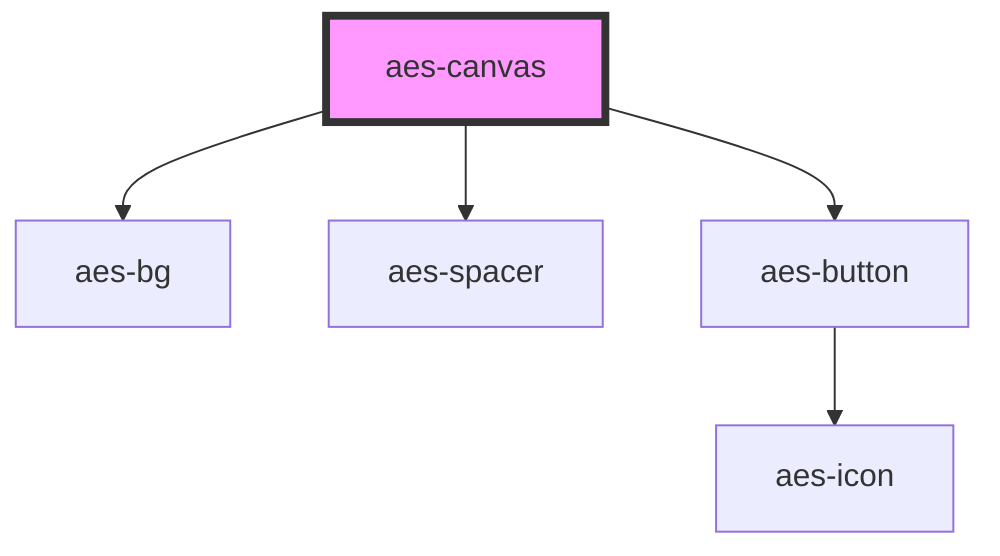

# aes-canvas

<!-- Auto Generated Below -->

## Properties

| Property             | Attribute              | Description                                                         | Type                                                                                                                                                                                                                                                                                                                                                                                                                                                                                                                                  | Default            |
| -------------------- | ---------------------- | ------------------------------------------------------------------- | ------------------------------------------------------------------------------------------------------------------------------------------------------------------------------------------------------------------------------------------------------------------------------------------------------------------------------------------------------------------------------------------------------------------------------------------------------------------------------------------------------------------------------------- | ------------------ |
| `autoplay`           | `autoplay`             | Whether to allow autoplay                                           | `boolean`                                                                                                                                                                                                                                                                                                                                                                                                                                                                                                                             | `false`            |
| `bgColor`            | `bg-color`             | Which brand color should be used as the background of this section? | `"neutrals-black" \| "neutrals-gray1" \| "neutrals-gray2" \| "neutrals-gray3" \| "neutrals-gray4" \| "neutrals-gray5" \| "neutrals-white" \| "transparent"`                                                                                                                                                                                                                                                                                                                                                                           | `'transparent'`    |
| `bgHoverImage`       | `bg-hover-image`       | The image to apply to the background on hover                       | `string`                                                                                                                                                                                                                                                                                                                                                                                                                                                                                                                              | `''`               |
| `bgVimeoVideo`       | `bg-vimeo-video`       | The vimeo video to show                                             | `string`                                                                                                                                                                                                                                                                                                                                                                                                                                                                                                                              | `''`               |
| `borderColor`        | `border-color`         | Which brand color should be used as the border of this section?     | `"transparent" \| "neutrals-white" \| "neutrals-gray1" \| "neutrals-gray2" \| "neutrals-gray3" \| "neutrals-gray4" \| "neutrals-gray5" \| "neutrals-black" \| "signature-blue1" \| "signature-blue2" \| "signature-blue3" \| "signature-blue4" \| "signature-purple1" \| "signature-purple2" \| "signature-purple3" \| "signature-purple4" \| "signature-aqua1" \| "signature-aqua2" \| "signature-aqua3" \| "signature-aqua4" \| "signature-green1" \| "signature-green2" \| "signature-green3" \| "signature-green4" \| "ui-error"` | `'neutrals-black'` |
| `controls`           | `controls`             | Whether to show controls on video                                   | `boolean`                                                                                                                                                                                                                                                                                                                                                                                                                                                                                                                             | `false`            |
| `cta`                | `cta`                  | Options for rendering a CTA Link button at the bottom               | `string \| { shouldDisplayArrow?: boolean; text: string; url: string; variant?: "primary" \| "secondary"; }`                                                                                                                                                                                                                                                                                                                                                                                                                          | `undefined`        |
| `displayBorder`      | `display-border`       | Whether to display a border around the component                    | `boolean`                                                                                                                                                                                                                                                                                                                                                                                                                                                                                                                             | `false`            |
| `displayDropShadow`  | `display-drop-shadow`  | Whether to display a drop shadow on the component                   | `boolean`                                                                                                                                                                                                                                                                                                                                                                                                                                                                                                                             | `false`            |
| `initialVolume`      | `initial-volume`       | what should be initial levels for video on first load               | `number`                                                                                                                                                                                                                                                                                                                                                                                                                                                                                                                              | `undefined`        |
| `outerPaddingBottom` | `outer-padding-bottom` | The optional padding to add to the bottom of the component wrapper  | `"0" \| "1" \| "2" \| "3" \| "4" \| "5" \| "6" \| "8" \| "10" \| "12" \| "20" \| "40" \| "16" \| "24" \| "32" \| "48" \| "56" \| "64" \| "72" \| "84" \| "96" \| "px"`                                                                                                                                                                                                                                                                                                                                                                | `undefined`        |
| `outerPaddingLeft`   | `outer-padding-left`   | The optional padding to add to the left of the component wrapper    | `"0" \| "1" \| "2" \| "3" \| "4" \| "5" \| "6" \| "8" \| "10" \| "12" \| "20" \| "40" \| "16" \| "24" \| "32" \| "48" \| "56" \| "64" \| "72" \| "84" \| "96" \| "px"`                                                                                                                                                                                                                                                                                                                                                                | `undefined`        |
| `outerPaddingRight`  | `outer-padding-right`  | The optional padding to add to the right of the component wrapper   | `"0" \| "1" \| "2" \| "3" \| "4" \| "5" \| "6" \| "8" \| "10" \| "12" \| "20" \| "40" \| "16" \| "24" \| "32" \| "48" \| "56" \| "64" \| "72" \| "84" \| "96" \| "px"`                                                                                                                                                                                                                                                                                                                                                                | `undefined`        |
| `outerPaddingTop`    | `outer-padding-top`    | The optional padding to add to the top of the component wrapper     | `"0" \| "1" \| "2" \| "3" \| "4" \| "5" \| "6" \| "8" \| "10" \| "12" \| "20" \| "40" \| "16" \| "24" \| "32" \| "48" \| "56" \| "64" \| "72" \| "84" \| "96" \| "px"`                                                                                                                                                                                                                                                                                                                                                                | `undefined`        |
| `paddingBottom`      | `padding-bottom`       | The optional padding to add to the bottom of the component body     | `"0" \| "1" \| "2" \| "3" \| "4" \| "5" \| "6" \| "8" \| "10" \| "12" \| "20" \| "40" \| "16" \| "24" \| "32" \| "48" \| "56" \| "64" \| "72" \| "84" \| "96" \| "px"`                                                                                                                                                                                                                                                                                                                                                                | `undefined`        |
| `paddingLeft`        | `padding-left`         | The optional padding to add to the left of the component body       | `"0" \| "1" \| "2" \| "3" \| "4" \| "5" \| "6" \| "8" \| "10" \| "12" \| "20" \| "40" \| "16" \| "24" \| "32" \| "48" \| "56" \| "64" \| "72" \| "84" \| "96" \| "px"`                                                                                                                                                                                                                                                                                                                                                                | `undefined`        |
| `paddingRight`       | `padding-right`        | The optional padding to add to the right of the component body      | `"0" \| "1" \| "2" \| "3" \| "4" \| "5" \| "6" \| "8" \| "10" \| "12" \| "20" \| "40" \| "16" \| "24" \| "32" \| "48" \| "56" \| "64" \| "72" \| "84" \| "96" \| "px"`                                                                                                                                                                                                                                                                                                                                                                | `undefined`        |
| `paddingTop`         | `padding-top`          | The optional padding to add to the top of the component body        | `"0" \| "1" \| "2" \| "3" \| "4" \| "5" \| "6" \| "8" \| "10" \| "12" \| "20" \| "40" \| "16" \| "24" \| "32" \| "48" \| "56" \| "64" \| "72" \| "84" \| "96" \| "px"`                                                                                                                                                                                                                                                                                                                                                                | `undefined`        |

## Slots

| Slot           | Description                                                               |
| -------------- | ------------------------------------------------------------------------- |
| `"body"`       | The primary slot to render editorial or WYSIWYG content.                  |
| `"multimedia"` | The slot to render an optional image, video or donut on top of the block. |

## Dependencies

### Depends on

- [aes-bg](../aes-bg)
- [aes-spacer](../aes-spacer)
- [aes-button](../aes-button)

### Graph

----------------------------------------------

*Built with [StencilJS](https://stenciljs.com/)*
