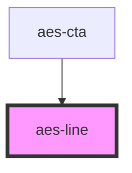

# aes-decor

The AES gradient line. Use CSS to rotate to achieve vertical style.

<!-- Auto Generated Below -->

## Properties

| Property          | Attribute          | Description                                                                        | Type                         | Default        |
| ----------------- | ------------------ | ---------------------------------------------------------------------------------- | ---------------------------- | -------------- |
| `animDuration`    | `anim-duration`    | The time the animation lasts https://developer.mozilla.org/en-US/docs/Web/CSS/time | `string`                     | `'1s'`         |
| `animObserver`    | --                 | Stores the IntersectionObserver instance                                           | `IntersectionObserver`       | `undefined`    |
| `animThreshold`   | `anim-threshold`   | Portion of the element visible to trigger the animation                            | `number`                     | `0.2`          |
| `direction`       | `direction`        | The direction for the line to exist.                                               | `"horizontal" \| "vertical"` | `'horizontal'` |
| `displayAnimated` | `display-animated` | Whether the line should be animated when                                           | `boolean`                    | `false`        |

## Dependencies

### Used by

 - [aes-cta](../aes-cta)

### Graph

----------------------------------------------

*Built with [StencilJS](https://stenciljs.com/)*
