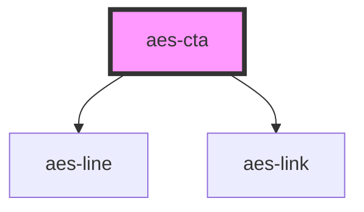

# aes-cta

<!-- Auto Generated Below -->

## Properties

| Property           | Attribute            | Description                           | Type                 | Default     |
| ------------------ | -------------------- | ------------------------------------- | -------------------- | ----------- |
| `displayLinkArrow` | `display-link-arrow` | Append a right arrow to the link text | `boolean`            | `true`      |
| `link`             | `link`               | The link url and text                 | `LinkType \| string` | `undefined` |

## Slots

| Slot           | Description                                                                                                                                                      |
| -------------- | ---------------------------------------------------------------------------------------------------------------------------------------------------------------- |
| `"header"`     | The header slot expects a heading element to render on the left side of the CTA.                                                                                 |
| `"multimedia"` | The multimedia slot expects an image element to render on the right side of the CTA. The consuming component is responsible for the responsiveness of the image. |

## Dependencies

### Depends on

- [aes-line](../aes-line)
- [aes-link](../aes-link)

### Graph

----------------------------------------------

*Built with [StencilJS](https://stenciljs.com/)*
