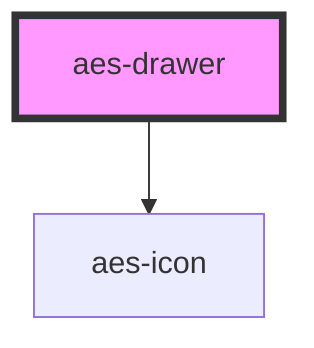

# aes-drawer

<!-- Auto Generated Below -->

## Slots

| Slot        | Description                                                        |
| ----------- | ------------------------------------------------------------------ |
| `"content"` | The markup to show in the fly-out drawer. Can be anything.         |
| `"trigger"` | Anything placed in here becomes a button that opens drawer content |

## Dependencies

### Depends on

- [aes-icon](../aes-icon)

### Graph

----------------------------------------------

*Built with [StencilJS](https://stenciljs.com/)*
