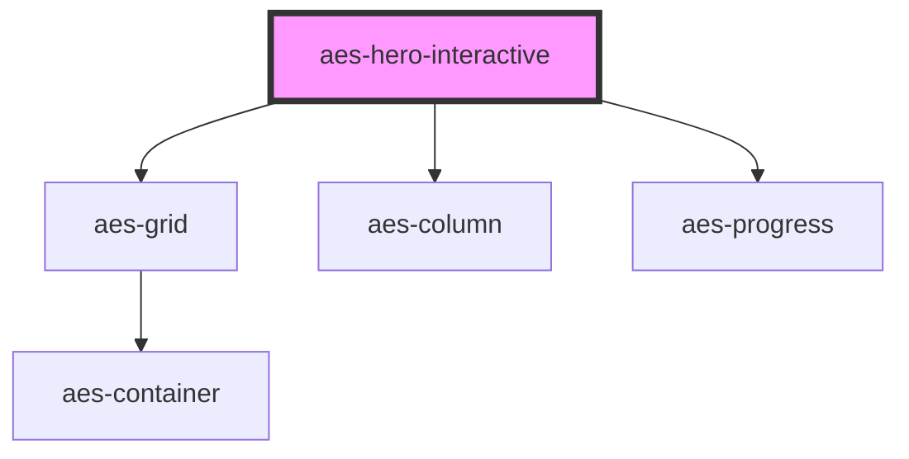

# aes-hero-interactive

<!-- Auto Generated Below -->

## Properties

| Property   | Attribute  | Description                                                | Type              | Default     |
| ---------- | ---------- | ---------------------------------------------------------- | ----------------- | ----------- |
| `bgImage`  | `bg-image` | The background image for low-motion users                  | `string`          | `undefined` |
| `bgVideo`  | `bg-video` | A url to an mp4 video to play full size in the background  | `string`          | `undefined` |
| `duration` | `duration` | How often should the slide should change (in milliseconds) | `number`          | `5000`      |
| `progress` | `progress` | How to show progress: a progress bar or "pips"             | `"bar" \| "pips"` | `'bar'`     |

## Dependencies

### Depends on

- [aes-grid](../aes-grid)
- [aes-column](../aes-column)
- [aes-progress](../aes-progress)

### Graph

----------------------------------------------

*Built with [StencilJS](https://stenciljs.com/)*
