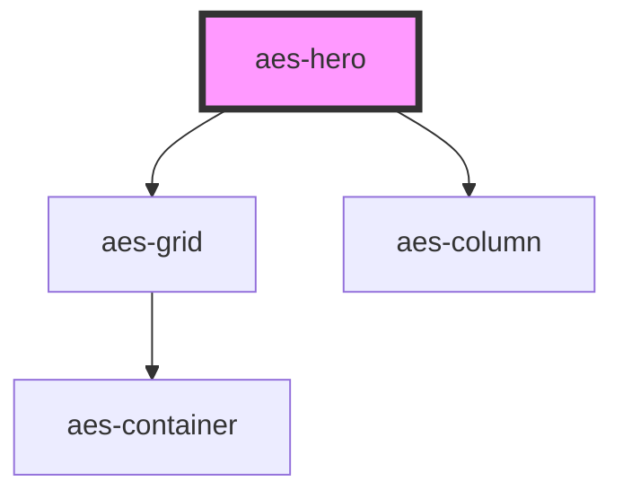

# aes-header

<!-- Auto Generated Below -->

## Properties

| Property  | Attribute | Description                                          | Type      | Default |
| --------- | --------- | ---------------------------------------------------- | --------- | ------- |
| `overlay` | `overlay` | Should the dark overlay sit over top of the bg image | `boolean` | `true`  |

## Slots

| Slot           | Description                                                                             |
| -------------- | --------------------------------------------------------------------------------------- |
| `"multimedia"` | The multimedia slot; expects either an `` tag or a responsive `<picture>` element. |
| `"title"`      | The title slot; the text that should be shown in the header.                            |

## Dependencies

### Depends on

- [aes-grid](../aes-grid)
- [aes-column](../aes-column)

### Graph

----------------------------------------------

*Built with [StencilJS](https://stenciljs.com/)*
