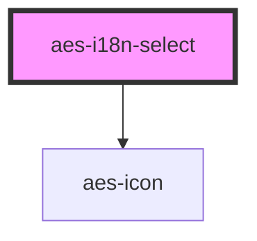

# aes-i18n-select

<!-- Auto Generated Below -->

## Properties

| Property   | Attribute  | Description                                | Type      | Default     |
| ---------- | ---------- | ------------------------------------------ | --------- | ----------- |
| `disabled` | `disabled` | Whether or not the select box is disabled. | `boolean` | `false`     |
| `options`  | `options`  | The list of options that should be shown.  | `string`  | `undefined` |
| `value`    | `value`    | The url that the user is on.               | `string`  | `undefined` |

## Dependencies

### Depends on

- [aes-icon](../aes-icon)

### Graph

----------------------------------------------

*Built with [StencilJS](https://stenciljs.com/)*
