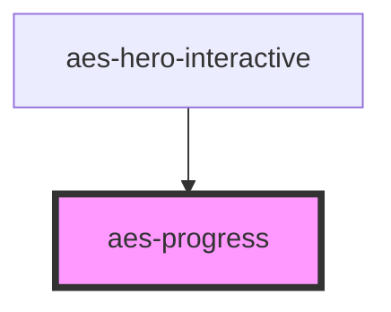

# aes-progress

<!-- Auto Generated Below -->

## Properties

| Property | Attribute | Description                    | Type     | Default     |
| -------- | --------- | ------------------------------ | -------- | ----------- |
| `max`    | `max`     | The value of "100%"            | `number` | `undefined` |
| `value`  | `value`   | The actual progress of the bar | `number` | `undefined` |

## Dependencies

### Used by

 - [aes-hero-interactive](../aes-hero-interactive)

### Graph

----------------------------------------------

*Built with [StencilJS](https://stenciljs.com/)*
