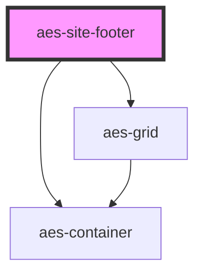

# aes-site-footer

<!-- Auto Generated Below -->

## Slots

| Slot             | Description                                     |
| ---------------- | ----------------------------------------------- |
| `"copyright"`    | The area to display copyright information.      |
| `"lang-select"`  | The language selection button.                  |
| `"logo"`         | The logo element to display in the site footer. |
| `"menus"`        | The slot that is expecting menus.               |
| `"social-links"` | The list of social links.                       |

## Dependencies

### Depends on

- [aes-container](../aes-container)
- [aes-grid](../aes-grid)

### Graph

----------------------------------------------

*Built with [StencilJS](https://stenciljs.com/)*
