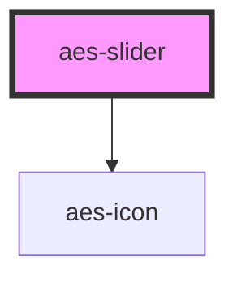

# aes-slider

<!-- Auto Generated Below -->

## Properties

| Property                  | Attribute                     | Description                                                                 | Type      | Default |
| ------------------------- | ----------------------------- | --------------------------------------------------------------------------- | --------- | ------- |
| `autoplay`                | `autoplay`                    | Whether to automatically advance slides                                     | `boolean` | `false` |
| `displayArrows`           | `display-arrows`              | Whether to display navigation arrows to switch slides                       | `boolean` | `false` |
| `displayDots`             | `display-dots`                | Whether to display navigation dots to switch slides                         | `boolean` | `false` |
| `duration`                | `duration`                    | Delay between slides change (miliseconds, requires active autoplay)         | `number`  | `5000`  |
| `initialized`             | `initialized`                 | Whether the slider has been initialized                                     | `boolean` | `false` |
| `loop`                    | `loop`                        | Whether to infinitely loop slides                                           | `boolean` | `false` |
| `slidesToDisplay`         | `slides-to-display`           | Number of slides to display (e.g. use 1.5 to display one and a half slides) | `number`  | `1`     |
| `slidesToDisplayOnMobile` | `slides-to-display-on-mobile` | Default no of slides visible on mobile view                                 | `number`  | `1.25`  |
| `spacing`                 | `spacing`                     | Spacing between slides                                                      | `number`  | `32`    |

## Slots

| Slot       | Description                            |
| ---------- | -------------------------------------- |
| `"slides"` | The slot containing the slide elements |

## Dependencies

### Depends on

- [aes-icon](../aes-icon)

### Graph

----------------------------------------------

*Built with [StencilJS](https://stenciljs.com/)*
