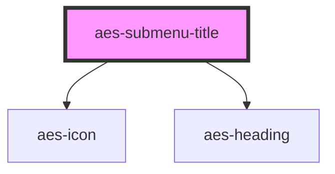

# aes-submenu-header

<!-- Auto Generated Below -->

## Properties

| Property | Attribute | Description                           | Type       | Default     |
| -------- | --------- | ------------------------------------- | ---------- | ----------- |
| `icon`   | `icon`    | The icon to display next to the text. | `IconType` | `undefined` |

## Slots

| Slot            | Description |
| --------------- | ----------- |
| `"defaultSlot"` |             |

## Dependencies

### Depends on

- [aes-icon](../aes-icon)
- [aes-heading](../aes-heading)

### Graph

----------------------------------------------

*Built with [StencilJS](https://stenciljs.com/)*
