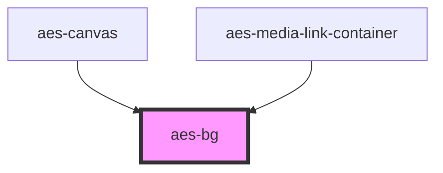

# aes-bg

<!-- Auto Generated Below -->

## Properties

| Property        | Attribute        | Description                                  | Type                                                                                                                                                        | Default     |
| --------------- | ---------------- | -------------------------------------------- | ----------------------------------------------------------------------------------------------------------------------------------------------------------- | ----------- |
| `color`         | `color`          | The neutral color to apply to the background | `"neutrals-black" \| "neutrals-gray1" \| "neutrals-gray2" \| "neutrals-gray3" \| "neutrals-gray4" \| "neutrals-gray5" \| "neutrals-white" \| "transparent"` | `undefined` |
| `imagePosition` | `image-position` | The position of the image.                   | `"bottom" \| "top-right"`                                                                                                                                   | `undefined` |
| `imageUrl`      | `image-url`      | The image to apply to the background         | `string`                                                                                                                                                    | `''`        |

## Slots

| Slot            | Description |
| --------------- | ----------- |
| `"defaultSlot"` |             |

## Dependencies

### Used by

 - [aes-canvas](../aes-canvas)
 - [aes-media-link-container](../aes-media-link-container)

### Graph

----------------------------------------------

*Built with [StencilJS](https://stenciljs.com/)*
