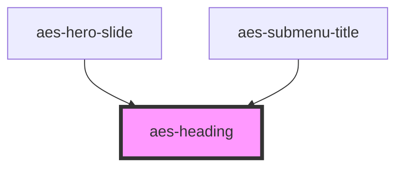

# aes-heading

<!-- Auto Generated Below -->

## Properties

| Property     | Attribute     | Description                                                                             | Type               | Default      |
| ------------ | ------------- | --------------------------------------------------------------------------------------- | ------------------ | ------------ |
| `level`      | `level`       | The heading tag to apply: 1 \| 2 \| 3 \| 4                                              | `1 \| 2 \| 3 \| 4` | `2`          |
| `levelStyle` | `level-style` | The heading level style to apply. Optional override to default styles for a given level | `1 \| 2 \| 3 \| 4` | `this.level` |
| `sub`        | `sub`         | The smaller, decorative subheading style                                                | `boolean`          | `false`      |

## Slots

| Slot            | Description |
| --------------- | ----------- |
| `"defaultSlot"` |             |

## Dependencies

### Used by

 - [aes-hero-slide](../aes-hero-slide)
 - [aes-submenu-title](../aes-submenu-title)

### Graph

----------------------------------------------

*Built with [StencilJS](https://stenciljs.com/)*
