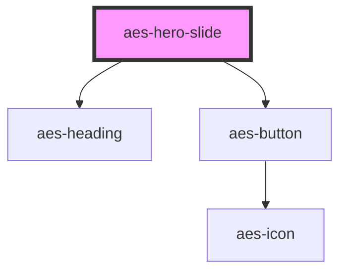

# aes-hero-slide

<!-- Auto Generated Below -->

## Properties

| Property   | Attribute  | Description                          | Type                                       | Default     |
| ---------- | ---------- | ------------------------------------ | ------------------------------------------ | ----------- |
| `cta`      | `cta`      | Link and text for button             | `string \| { text: string; url: string; }` | `undefined` |
| `eyebrow`  | `eyebrow`  | Text that appears above the headline | `string`                                   | `undefined` |
| `headline` | `headline` | The main headline                    | `string`                                   | `undefined` |

## Dependencies

### Depends on

- [aes-heading](../aes-heading)
- [aes-button](../aes-button)

### Graph

----------------------------------------------

*Built with [StencilJS](https://stenciljs.com/)*
