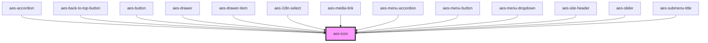

# aes-icon

<!-- Auto Generated Below -->

## Properties

| Property | Attribute | Description                                                        | Type       | Default     |
| -------- | --------- | ------------------------------------------------------------------ | ---------- | ----------- |
| `icon`   | `icon`    | The icon type to display from ./assets. Takes precedence over url. | `IconType` | `undefined` |
| `url`    | `url`     | The url to display a remote icon                                   | `string`   | `''`        |

## Dependencies

### Used by

 - [aes-accordion](../aes-accordion)
 - [aes-back-to-top-button](../aes-back-to-top-button)
 - [aes-button](../aes-button)
 - [aes-drawer](../aes-drawer)
 - [aes-drawer-item](../aes-drawer-item)
 - [aes-i18n-select](../aes-i18n-select)
 - [aes-media-link](../aes-media-link)
 - [aes-menu-accordion](../aes-menu-accordion)
 - [aes-menu-button](../aes-menu-button)
 - [aes-menu-dropdown](../aes-menu-dropdown)
 - [aes-site-header](../aes-site-header)
 - [aes-slider](../aes-slider)
 - [aes-submenu-title](../aes-submenu-title)

### Graph

----------------------------------------------

*Built with [StencilJS](https://stenciljs.com/)*
