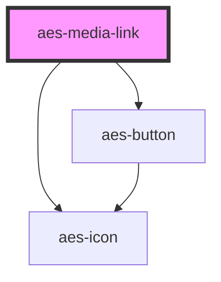

# aes-media-link

<!-- Auto Generated Below -->

## Properties

| Property            | Attribute             | Description                                                                                                                               | Type                                         | Default                     |
| ------------------- | --------------------- | ----------------------------------------------------------------------------------------------------------------------------------------- | -------------------------------------------- | --------------------------- |
| `icon`              | `icon`                | The icon to show next to the link.                                                                                                        | `IconType`                                   | `IconType.DOCUMENT_DEFAULT` |
| `shouldDisplayIcon` | `should-display-icon` | Whether to show the document icon                                                                                                         | `boolean`                                    | `true`                      |
| `target`            | `target`              | The target to use for the link, used in conjunction with the url. Always open in a new tab because this should always link to a document. | `"_blank" \| "_parent" \| "_self" \| "_top"` | `'_blank'`                  |
| `url`               | `url`                 | The url to use for the link. This will render an anchor element.                                                                          | `string`                                     | `undefined`                 |

## Slots

| Slot        | Description                                    |
| ----------- | ---------------------------------------------- |
| `"default"` | The slot to render as the component link text. |

## Dependencies

### Depends on

- [aes-icon](../aes-icon)
- [aes-button](../aes-button)

### Graph

----------------------------------------------

*Built with [StencilJS](https://stenciljs.com/)*
