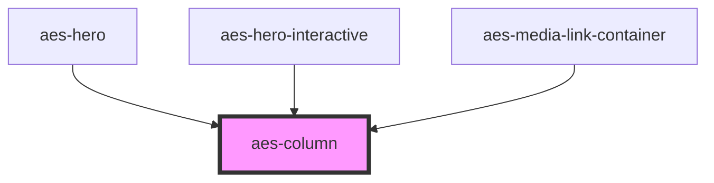

# aes-column

<!-- Auto Generated Below -->

## Properties

| Property         | Attribute          | Description                                                                     | Type                                                          | Default     |
| ---------------- | ------------------ | ------------------------------------------------------------------------------- | ------------------------------------------------------------- | ----------- |
| `colSpanDefault` | `col-span-default` | The number of columns wide this column should be.                               | `1 \| 10 \| 11 \| 12 \| 2 \| 3 \| 4 \| 5 \| 6 \| 7 \| 8 \| 9` | `12`        |
| `colSpanLg`      | `col-span-lg`      | The number of columns wide this column should be on large+ screens.             | `1 \| 10 \| 11 \| 12 \| 2 \| 3 \| 4 \| 5 \| 6 \| 7 \| 8 \| 9` | `undefined` |
| `colSpanMd`      | `col-span-md`      | The number of columns wide this column should be on medium+ screens.            | `1 \| 10 \| 11 \| 12 \| 2 \| 3 \| 4 \| 5 \| 6 \| 7 \| 8 \| 9` | `undefined` |
| `colSpanSm`      | `col-span-sm`      | The number of columns wide this column should be on small+ screens.             | `1 \| 10 \| 11 \| 12 \| 2 \| 3 \| 4 \| 5 \| 6 \| 7 \| 8 \| 9` | `undefined` |
| `colSpanXl`      | `col-span-xl`      | The number of columns wide this column should be on extra large+ screens.       | `1 \| 10 \| 11 \| 12 \| 2 \| 3 \| 4 \| 5 \| 6 \| 7 \| 8 \| 9` | `undefined` |
| `colSpanXxl`     | `col-span-xxl`     | The number of columns wide this column should be on extra extra large+ screens. | `1 \| 10 \| 11 \| 12 \| 2 \| 3 \| 4 \| 5 \| 6 \| 7 \| 8 \| 9` | `undefined` |
| `contentAlign`   | `content-align`    | The vertical placement of content inside of the column.                         | `"bottom" \| "middle" \| "top"`                               | `'middle'`  |

## Slots

| Slot            | Description |
| --------------- | ----------- |
| `"defaultSlot"` |             |

## Dependencies

### Used by

 - [aes-hero](../aes-hero)
 - [aes-hero-interactive](../aes-hero-interactive)
 - [aes-media-link-container](../aes-media-link-container)

### Graph

----------------------------------------------

*Built with [StencilJS](https://stenciljs.com/)*
