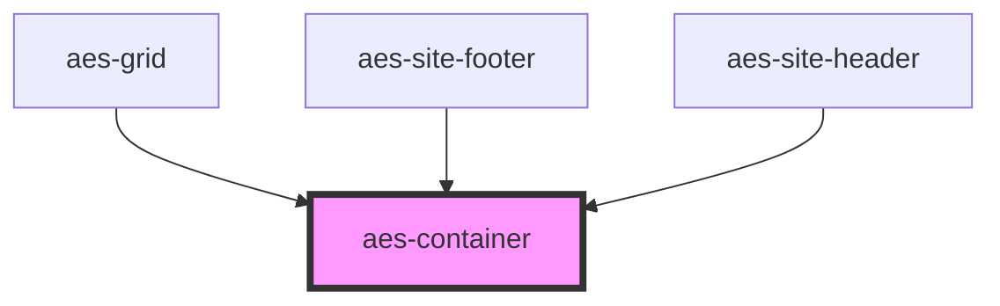

# aes-container

Contain content to the design system widths at the next breakpoint up.

- xs+: 100%
- sm+: 640px
- md+: 768px
- lg+: 1024px
- xl+: 1280px

<!-- Auto Generated Below -->

## Properties

| Property   | Attribute   | Description                                                                | Type      | Default |
| ---------- | ----------- | -------------------------------------------------------------------------- | --------- | ------- |
| `isNested` | `is-nested` | Whether or not this is a nested container. If it's nested, remove padding. | `boolean` | `false` |

## Slots

| Slot            | Description |
| --------------- | ----------- |
| `"defaultSlot"` |             |

## Dependencies

### Used by

 - [aes-grid](../aes-grid)
 - [aes-site-footer](../aes-site-footer)
 - [aes-site-header](../aes-site-header)

### Graph

----------------------------------------------

*Built with [StencilJS](https://stenciljs.com/)*
