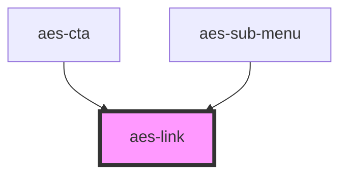

# aes-link

<!-- Auto Generated Below -->

## Properties

| Property | Attribute | Description              | Type                                         | Default     |
| -------- | --------- | ------------------------ | -------------------------------------------- | ----------- |
| `href`   | `href`    | The <a> href attribute   | `string`                                     | `undefined` |
| `rel`    | `rel`     | The <a> rel attribute    | `string`                                     | `undefined` |
| `target` | `target`  | The <a> target attribute | `"_blank" \| "_parent" \| "_self" \| "_top"` | `'_self'`   |

## Slots

| Slot            | Description |
| --------------- | ----------- |
| `"defaultSlot"` |             |

## Dependencies

### Used by

 - [aes-cta](../aes-cta)
 - [aes-sub-menu](../aes-sub-menu)

### Graph

----------------------------------------------

*Built with [StencilJS](https://stenciljs.com/)*
