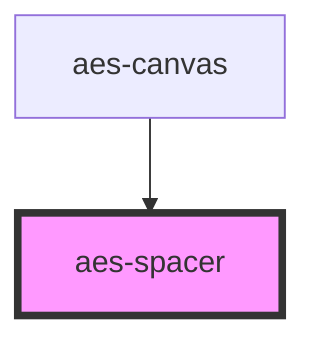

# aes-spacer

<!-- Auto Generated Below -->

## Properties

| Property | Attribute | Description                         | Type                                                                                                                                                                   | Default |
| -------- | --------- | ----------------------------------- | ---------------------------------------------------------------------------------------------------------------------------------------------------------------------- | ------- |
| `b`      | `b`       | Bottom spacing from Tailwind config | `"0" \| "1" \| "2" \| "3" \| "4" \| "5" \| "6" \| "8" \| "10" \| "12" \| "20" \| "40" \| "16" \| "24" \| "32" \| "48" \| "56" \| "64" \| "72" \| "84" \| "96" \| "px"` | `'0'`   |
| `l`      | `l`       | Left spacing from Tailwind config   | `"0" \| "1" \| "2" \| "3" \| "4" \| "5" \| "6" \| "8" \| "10" \| "12" \| "20" \| "40" \| "16" \| "24" \| "32" \| "48" \| "56" \| "64" \| "72" \| "84" \| "96" \| "px"` | `'0'`   |
| `r`      | `r`       | Right spacing from Tailwind config  | `"0" \| "1" \| "2" \| "3" \| "4" \| "5" \| "6" \| "8" \| "10" \| "12" \| "20" \| "40" \| "16" \| "24" \| "32" \| "48" \| "56" \| "64" \| "72" \| "84" \| "96" \| "px"` | `'0'`   |
| `t`      | `t`       | Top spacing from Tailwind config    | `"0" \| "1" \| "2" \| "3" \| "4" \| "5" \| "6" \| "8" \| "10" \| "12" \| "20" \| "40" \| "16" \| "24" \| "32" \| "48" \| "56" \| "64" \| "72" \| "84" \| "96" \| "px"` | `'0'`   |

## Slots

| Slot        | Description                                         |
| ----------- | --------------------------------------------------- |
| `"default"` | Wrapped content that needs some padding on an axis. |

## Dependencies

### Used by

 - [aes-canvas](../aes-canvas)

### Graph

----------------------------------------------

*Built with [StencilJS](https://stenciljs.com/)*
